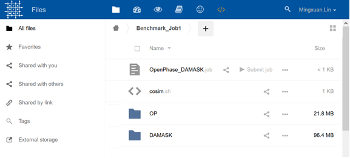
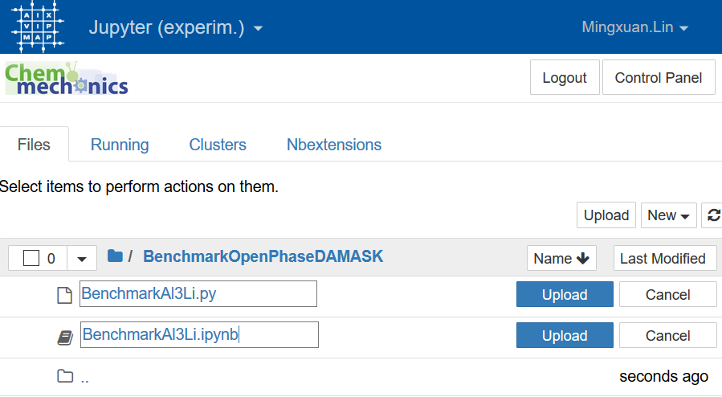
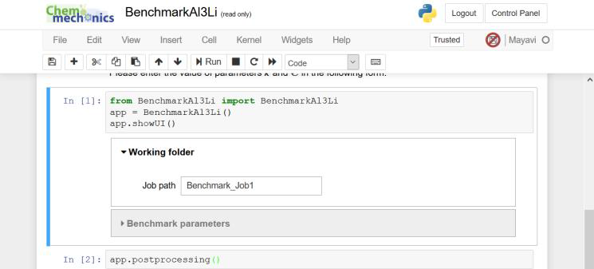
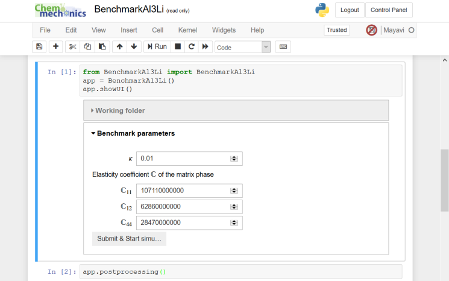
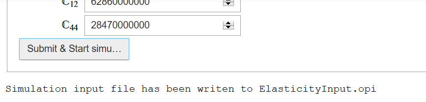
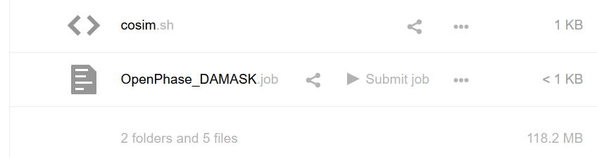
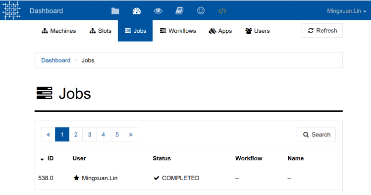
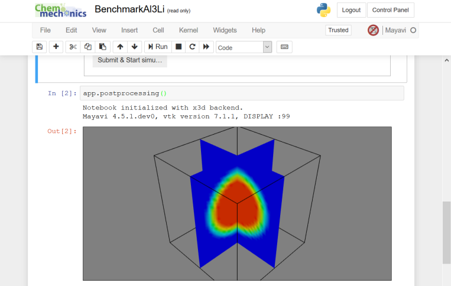

This document describes the steps to run simulations of the chemo-mechanical coupled benchmark problem using a cloud computing service [AixViPMaP](http://aixvipmap.de/). This service is only open to [registered](http://www.icme.rwth-aachen.de/cms/ICME/Forschung/AixViPMaP/~qedp/Anmeldung/lidx/1/) users.

1. Upload the entire folder "Template_Benchmark_Al3Li" to the cloud and put it under your home folder (using Firefox in Windows, simply drag and drop the folder from file explorer to the webpage). You may rename the folder to "Benchmark_Job1" so that it is easier to remember. Click into the folder to make sure every file is uploaded successfully.

2. Click the "Jupyter" **`</>`**  button at the right side of the blue bar. Upload the folder "Jupyter_notebooks" to your home directory. Please do not rename any file with the `.py` extension.

3. Click to open the notebook "BenchmarkAl3Li.ipynb" and then click button :arrow_forward: "Run" in the menu.

4. Fill in the name of the working folder (which you just uploaded and renamed in step 1) and also the model parameters.

5. Click the button "Submit & Start simu…"

6. Click the link "Job folder" to open the working folder which you have uploaded. Locate the file "OpenPhase_DAMASK.job" and click the button "Submit job".

7. After successful submission, the job will run in the background. You may check its status in the dashboard. The job may take 30 min to a few hours, depending on your model parameters. When its status turns "Completed", you can proceed with post-processing.

8. To plot the concentration field of Li at the time step 10000, run the second cell in the Jupyter notebook.

The notebook session will expired 1 hour after login. If you see any authentication error, please re-login and then restart the Jupyter server (Goto “Control Panel”).

9. The raw VTK files can be found under the working folder. You may use the "Files" tab to open and download them.
